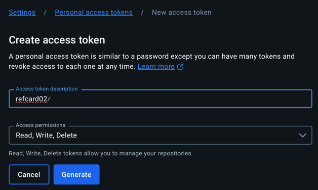
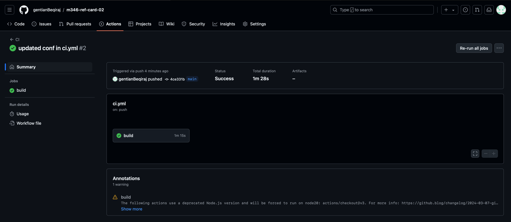
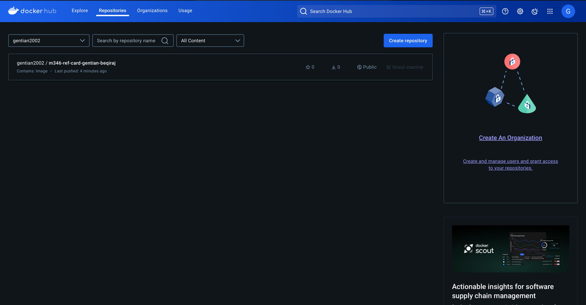

# Architecture Ref.Card 02 - React Application (serverless)

Link zur Übersicht<br/>
https://gitlab.com/bbwrl/m346-ref-card-overview

## Installation der benötigten Werkzeuge

Für das Bauen der App wird Node bzw. npm benötigt. Die Tools sind unter 
der folgenden URL zu finden. Für die meisten Benutzer:innen empfiehlt sich 
die LTS Version.<br/>
https://nodejs.org/en/download/

Node Version Manager<br/>
Für erfahren Benutzer:innen empfiehlt sich die Installation des 
Node Version Manager nvm. Dieses Tool erlaubt das Installiert und das 
Wechseln der Node Version über die Kommandozeile.<br/>
**Achtung: Node darf noch nicht auf dem Computer installiert sein.**<br/>
https://learn2torials.com/a/how-to-install-nvm


## Inbetriebnahme auf eigenem Computer

Projekt herunterladen<br/>
```git clone git@gitlab.com:bbwrl/m346-ref-card-02.git```
<br/>
```cd architecture-refcard-02```

### Projekt bauen und starten
Die Ausführung der Befehle erfolgt im Projektordner

Builden mit Node/npm<br/>
```$ npm install```

Das Projekt wird gebaut und die entsprechenden Dateien unter dem Ordner node_modules gespeichert.

Die App kann nun mit folgendem Befehl gestartet werden<br/>
```$ npm start```

Die App kann nun im Browser unter der URL http://localhost:3000 betrachtet werden.


### Inbetriebnahme mit Docker Container
1. ```Dockerfile``` im Root vom Projekt mit folgender Konfiguration erstellen:
   ```
   FROM node:16-alpine
   WORKDIR /app
   COPY package*.json ./
   RUN npm install
   RUN npm update
   COPY . .
   EXPOSE 3000
   CMD ["npm", "start"]
   ```


### GitHub Actions konfigurieren
1. Erstelle ein ```.github/workflows/ci.yml``` file
2. Auf www.docker.com ein Token generieren:
   
3. Docker Hub Credentials als Secrets hinzufügen
   ```
   name: CI

   on:
     push:
       branches: [ main ]

   jobs:
     build:
       runs-on: ubuntu-latest

       steps:
         - uses: actions/checkout@v3
         - name: Build the Docker image
           run: docker build -t gentian2002/m346-ref-card-gentian-beqiraj .
         - name: Log in to Docker Hub
           run: docker login -u gentian2002 -p  ${{ secrets.DOCKER_PASSWORD }}
         - name: Push the Docker image
           run: docker push gentian2002/m346-ref-card-gentian-beqiraj
   ```
4. Secrets in meinem GitHub Repository Settings erstellen.
   
5. Änderungen pushen. (Anschliessend wird die Github Actions ausgeführt und ein Container wird auf 
   DockerHub erstellt.)

### Schlussfolgerung
Diese Pipeline automatisiert den Prozess des Builden, Testens und Deployen meiner React-App. 
Sie kann weiter angepasst werden, um zusätzliche Schritte wie die Ausführung von Tests, das 
Deployment auf einem Server oder die Verwendung von Caching einzubeziehen.

