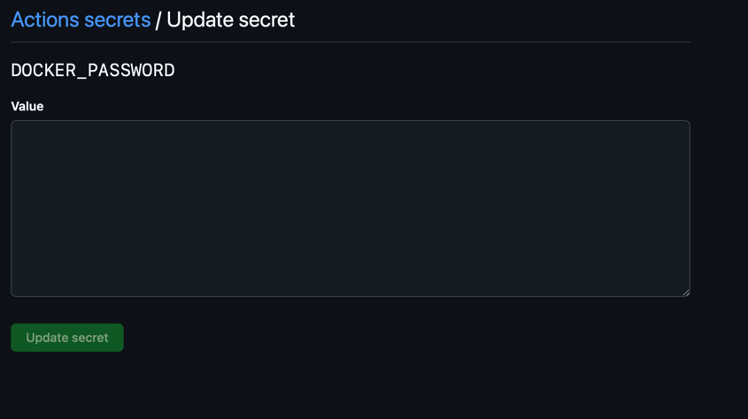
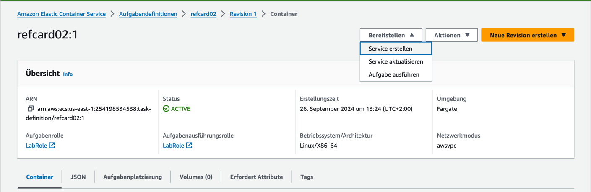

# Architecture Ref.Card 02 - React Application (serverless)

Link zur Übersicht<br/>
https://gitlab.com/bbwrl/m346-ref-card-overview

## Installation der benötigten Werkzeuge

Für das Bauen der App wird Node bzw. npm benötigt. Die Tools sind unter 
der folgenden URL zu finden. Für die meisten Benutzer:innen empfiehlt sich 
die LTS Version.<br/>
https://nodejs.org/en/download/

Node Version Manager<br/>
Für erfahren Benutzer:innen empfiehlt sich die Installation des 
Node Version Manager nvm. Dieses Tool erlaubt das Installiert und das 
Wechseln der Node Version über die Kommandozeile.<br/>
**Achtung: Node darf noch nicht auf dem Computer installiert sein.**<br/>
https://learn2torials.com/a/how-to-install-nvm


## Inbetriebnahme auf eigenem Computer

Projekt herunterladen<br/>
```git clone git@gitlab.com:bbwrl/m346-ref-card-02.git```
<br/>
```cd architecture-refcard-02```

### Projekt bauen und starten
Die Ausführung der Befehle erfolgt im Projektordner

Builden mit Node/npm<br/>
```$ npm install```

Das Projekt wird gebaut und die entsprechenden Dateien unter dem Ordner node_modules gespeichert.

Die App kann nun mit folgendem Befehl gestartet werden<br/>
```$ npm start```

Die App kann nun im Browser unter der URL http://localhost:3000 betrachtet werden.

### Inbetriebnahme mit Docker Container
1. ``Dockerfile`` im Root vom Projekt mit folgender Konfiguration erstellen:
   ```.dockerfile
   FROM node:16-alpine
   WORKDIR /app
   COPY package*.json ./
   RUN npm install
   RUN npm update
   COPY . .
   EXPOSE 3000
   CMD ["npm", "start"]
   ```
2. Docker Image builden und pushen
   ```.shell
   docker build -t  gentian2002/m346-ref-card-gentian-beqiraj .
   docker push  gentian2002/m346-ref-card-gentian-beqiraj
   ```

### GitHub Actions konfigurieren
1. Erstelle ein ```.github/workflows/ci.yml``` file
2. Auf www.docker.com ein Token generieren:
   
3. Docker Hub Credentials als Secrets hinzufügen
   ```.yaml
   name: CI

   on:
     push:
       branches: [ main ]

   jobs:
     build:
       runs-on: ubuntu-latest

       steps:
         - uses: actions/checkout@v3
         - name: Build the Docker image
           run: docker build -t gentian2002/m346-ref-card-gentian-beqiraj .
         - name: Log in to Docker Hub
           run: docker login -u $DOCKER_USERNAME -p  ${{ secrets.DOCKER_PASSWORD }}
         - name: Push the Docker image
           run: docker push gentian2002/m346-ref-card-gentian-beqiraj
   ```
4. Secrets in meinem GitHub Repository Settings erstellen.
   
5. Änderungen pushen. (Anschliessend wird die Github Actions ausgeführt und ein Container wird auf 
   DockerHub erstellt.)

### Schlussfolgerung
Diese Pipeline automatisiert den Prozess des Builden, Testens und Deployen meiner React-App. 
Sie kann weiter angepasst werden, um zusätzliche Schritte wie die Ausführung von Tests, das 
Deployment auf einem Server oder die Verwendung von Caching einzubeziehen.


## Docker auf AWS builden und deployen
Dieses Repository enthält einen GitHub Actions-Workflow zur Automatisierung des Prozesses der 
Erstellung eines Docker-Images und dessen Bereitstellung in einer Amazon Web Services (AWS) Elastic 
Container Registry (ECR) und EC2-Instanz.

### Workflow Übersicht

#### 1. Variablen und Secrets setzen
- **Repository Secrets**
   Um den AWS CLI zu nutzen, müssen die AWS tokens (`AWS_ACCESS_KEY_ID`, `AWS_REGION`, 
   `AWS_SECRET_ACCESS_KEY` und `AWS_SESSION_TOKEN`) als Secrets auf GitHub gespeichert sein.
   
   
- **Repository Variablen**
  Zur Verwaltung der Versionierung verwenden wir die Variable `VERSION`. Diese Variable wird 
  verwendet, um das Docker-Image und die GitHub-Version zu kennzeichnen. Wir müssen diese Variable 
  jedes Mal inkrementieren, wenn das Production Deployment erfolgreich durchgeführt wurde. 

#### 2. ECR-Repository erstellen.
1. Suche in der AWS Konsole nach "ECR".
2. Klicke auf "Repository Erstellen".
3. Benenne das Repository und übernehme die Default-Einstellungen. Klicke erneut auf "Erstellen".
   
4. Repository wird nun erstellt.
   

#### Job builden
- **Läuft auf**: `ubuntu-latest`
- **Schritte**:
   1. **Checkout Code**: Ruft den Code aus dem Repository ab.
   2. **AWS-Credentials einrichten**: Konfiguriert AWS CLI mit den in GitHub Secrets gespeicherten Creditentials.
   3. **Anmelden bei Amazon ECR**: Authentifiziert den Docker-Client gegenüber dem Amazon ECR-Service.
   4. **Docker-Image erstellen**: Erzeugt das Docker-Image aus der Dockerdatei im Repository.
   5. **Tag Docker Image**: Markiert das erstellte Docker-Image für ECR.
   6. **Docker-Image zu Amazon ECR pushen**: Pusht das getaggte Docker-Image zu ECR.
- Danach wird es an ECR gesendet und sollte wie folgt aussehen:

#### 3. ECS-Cluster erstellen
1. Suche in der AWS Konsole nach "ESC".
2. Klicke auf "Cluster erstellen".
3. Cluster benennen und Default Einstellung übernehmen. Wieder auf "Erstellen" klicken.
   
4. Cluster wurde erstellt.
   

#### 4. ECS-Aufgabendefinition erstellen
1. Gehe zu Aufgabendefinitionen und klicke auf "Neue Aufgabendefinition erstellen".
2. Namen geben und Aufgaben- und Aufgabenausführungsrolle auf "LabRole" setzen.
   
3. Repository-Namen und -URI definieren. Port auf 8080 setzen.
   
4. Auf "Erstellen klicken".
   

#### 5. ECS-Service erstellen
1. Klicke auf "Bereitstellen" und dann auf "Service erstellen".
   
2. Cluster selektieren.
   
3. Service-Name geben.
   
4. Auf erstellen klicken und überprüfen, ob die Applikation richtig läuft.
   


